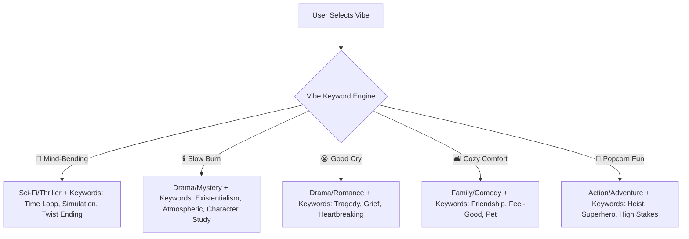

# Flixy Brainstorming Blueprint: Advanced Filtering & Features

This document outlines a product and architectural blueprint for expanding Flixy's Live-TMDB and Supabase-backed discovery loop. It details how to leverage TMDb's rich metadata to deliver state-of-the-art filtering (genres, years, countries, modes, and vibes) and introduces 5 high-impact features aligned with Flixy’s core principles: **gesture beats menu, cinematic focus, and zero-latency feedback.**

---

## 1. Executive Summary & Core Alignment

Flixy is built on a primary value proposition: **eliminating the "Netflix scroll" paralysis** through an instant, decisive, one-card-at-a-time gesture loop. 

To improve filtering without devolving into an IMDb-clone database grid, any new filter or feature must satisfy the **Always-On Laws of UX**:
1. **Walter’s Hierarchy (Usable → Pleasurable)**: Features must stay functional and reliable first. We prioritize local-first responsiveness and clean API mappings over complex remote computations.
2. **Hick’s Law (Decision Fatigue)**: More filter options must not mean more cognitive load. We chunk advanced options into progressive disclosures and elegant presets.
3. **Norman’s Feedback & Constraints**: Swiping states must react in <300ms, and invalid actions (e.g., filtering combinations that yield zero results) must be prevented or recovered from gracefully.

---

## 2. TMDb API Capability Deep Dive

To prevent the **N+1 API query bottleneck** (fetching list items first, then firing subsequent requests for providers or trailers), we must maximize the single `/discover/{movie|tv}` and `/search/multi` calls. 

TMDb offers several high-value query parameters that map perfectly to advanced filters:

| Filter Dimension | TMDb Parameter | Local Data / API Payload Mapping |
| :--- | :--- | :--- |
| **Unified Genres** | `with_genres`, `without_genres` | Combines Movie (e.g., 28) and TV (e.g., 10759) genre IDs into a single client-facing ID (e.g., `action`). |
| **Custom Eras / Years** | `primary_release_date.gte` / `.lte` | Standardizes decade bins or allows exact year-range boundary filtering (e.g., `2005-01-01` to `2012-12-31`). |
| **Origin Country** | `with_origin_country` | Limits titles to specific cultural hubs (e.g., South Korea `KR`, France `FR`, United Kingdom `GB`). |
| **Original Language** | `with_original_language` | Discovers original voice tracks (e.g., Japanese `ja` for anime, Spanish `es` for telenovelas/cinema). |
| **Vibes (Keywords)** | `with_keywords`, `without_keywords` | Explores specific thematic tags (e.g., "time travel" `3801`, "dystopia` `2853`, "twist ending" `9714`). |
| **Region-Aware Providers** | `with_watch_providers`, `watch_region` | Filters titles by active subscription services (e.g., Netflix `8`, Disney+ `337`) in the user's specific region. |
| **Quality Ratings** | `vote_average.gte`, `vote_count.gte` | Suppresses low-quality noise by ensuring titles have a minimum score and a baseline number of reviews. |

---

## 3. Filtering System Reinvention

### A. Genres: Strict Multi-Select & Exclusions
Currently, Flixy uses basic OR-based genre tags. We can elevate this to support complex taste structures:
1. **AND/OR Toggle**: 
   - **OR mode (Default)**: Show titles that are *either* Action *or* Sci-Fi.
   - **AND mode (Strict)**: Show only titles that are *both* Action *and* Sci-Fi (e.g., *The Matrix*, *Blade Runner 2049*).
2. **Genre Exclusions (Negative Filtering)**:
   - Allow users to long-press a genre to **exclude** it.
   - *Example*: "I want comedies, but absolutely NO romance."
   - *TMDb Mapping*: Pass excluded IDs to the `without_genres` query parameter (e.g., `without_genres=10749`).

### B. Years & Eras: Cinematic Time Travel
Instead of a simple "decades list," we introduce **Cultural Eras**:
- **Golden Age (1920–1960)**: Early Hollywood classics, film noir, musical legends.
- **New Hollywood (1960–1980)**: Gritty, auteur-driven cinema (*The Godfather*, *Taxi Driver*).
- **Blockbuster Nostalgia (1980–2000)**: Neon sci-fi, classic family adventure (*Back to the Future*, *Jurassic Park*).
- **The Prestige Era (2000–2015)**: Peak drama, modern thrillers (*Inception*, *The Dark Knight*).
- **Ultra Modern (2015–Present)**: Contemporary releases and streaming exclusives.
- **Custom Range Slider**: An interactive dual-thumb slider (anchored on the 8-pt grid) to specify exact release boundaries (e.g., `1994` to `2004`).

### C. Country & Language: Cultural Curations
Leverage TMDb's language and origin country parameters to build **Cultural Channels**:
- 🍣 **Anime & Japanese Cinema**: `with_genres=16` (Animation) + `with_original_language=ja`.
- 🥢 **K-Drama & Thrillers**: `with_origin_country=KR`.
- ☕ **Nordic Noir**: `with_original_language=no\|sv\|da\|fi` + `with_genres=80` (Crime).
- 🥐 **European Art-House**: `with_origin_country=FR\|IT\|DE\|ES` + `vote_average.gte=7.0` + popularity capped to ignore mainstream blockbusters.

### D. Vibes: Emotional State Mapping (The Keyword Engine)
Vibes capture *how a user wants to feel*, which traditional genre labels fail to express. We map client-side "Vibes" to specific combinations of TMDb genres and keyword IDs:



- **TMDb Keywords Mapping Table**:
  - **Mind-Bending**: Keywords `time travel (3801)`, `simulation (310906)`, `plot twist (9714)`, `reality (156350)`.
  - **Slow Burn**: Keywords `slow pace (250085)`, `atmospheric (180547)`, `existentialism (223652)`.
  - **Tearjerker**: Keywords `grief (160868)`, `tragedy (180556)`, `terminal illness (10323)`.
  - **Cozy / Feel-Good**: Keywords `friendship (6075)`, `coming of age (4379)`, `uplifting (256191)`.

---

## 4. New Feature Proposals (Cinematic & Dynamic UX)

### Feature 1: "Flixy Together" (Co-Op Group Matching)
*The Tinder-for-Movies solve for couples and friend groups.*

```
   User A (Host)                      User B (Guest)
+-------------------+              +-------------------+
|  Generate Group   |              |   Enter Group     |
|    Code: 8492     | -----------> |    Code: [8492]   |
+---------+---------+              +---------+---------+
          |                                  |
          +----------------+-----------------+
                           v
              +--------------------------+
              |  Shared Realtime Session |
              |  Swipe on identical deck |
              +------------+-------------+
                           |
            [User A & B both swipe right]
                           v
              +--------------------------+
              |     IT'S A MATCH!        |
              | Celebrate & Deeplink     |
              +--------------------------+
```

* **How it Works**:
  1. User A taps **"Swipe Together"** on their Profile tab and gets a 4-digit session code (e.g., `8492`).
  2. User B enters the code on their device.
  3. The app establishes a shared swipe session using **Supabase Realtime Channels** (broadcast mode).
  4. Both users swipe on the exact same deck in real time. 
  5. The server/client tracks overlap. When both users swipe **Right** (Save) on the same title, the swipe loop halts on both screens to trigger a full-screen **"Match!" celebration card**, displaying where it's streaming and a direct link to watch.
* **Why it's Premium**: Solves the core social dilemma of shared streaming fatigue instantly without requiring complex backend database syncing.

### Feature 2: "Watchlist Triage" (Gamified Backlog Clearing)
*Stop watchlists from becoming movie cemeteries.*

* **How it Works**:
  1. The user goes to the Watchlist tab and taps a floating action button: 🕹️ **"Triage Backlog"**.
  2. The app loads the user's *own watchlist* into a dedicated swipe deck.
  3. The gestures change meaning:
     - **Swipe Right**: "Watch Tonight" (pins the item to a short-list).
     - **Swipe Left**: "Keep for Later" (leaves it in the backlog).
     - **Swipe Down (Seen)**: "Already watched this" (asks for a quick rating and archives it).
     - **Swipe Up (Delete)**: "Remove from Watchlist" (deletes the row).
* **Why it's Premium**: Turns a tedious list-pruning chore into a 30-second game, keeping the watchlist fresh and action-oriented.

### Feature 3: "Blind Date" Mode (Anti-Bias Discovery)
*Discover movies based on story, not marketing hype or familiar faces.*

* **How it Works**:
  1. Toggling **"Blind Date"** mode hides the poster art (blurs it heavily) and redacts the Title/Actors.
  2. The card displays only:
     - The **Logline (Overview)** with character names redacted.
     - Unified **Vibe Tags** (e.g., *Atmospheric, Psychological, Nostalgic*).
     - **Runtime & Release Year**.
     - **Unified Ratings** (e.g., *IMDb 8.2*).
  3. When the user swipes **Right (Save)**, the poster and title unblur in a gorgeous, hardware-accelerated fluid animation, revealing the film they just unlocked.
* **Why it's Premium**: Gamifies movie discovery, appeals to hardcore cinephiles, and helps users discover under-the-radar masterpieces they would normally skip based on poster aesthetics.

### Feature 4: "Trailer-First" Swipe Feed (TikTok Mode)
*Move from static cards to immersive video discovery.*

* **How it Works**:
  1. Toggling **"Video Mode"** on the Discover tab transforms the card deck into a vertical, auto-playing video feed.
  2. As the card comes into focus, the app loads the TMDb trailer key (`trailerKey`) and streams the YouTube video muted in a seamless, looped frame.
  3. **Gestures**:
     - **Double Tap**: Unmutes/Mutes the audio.
     - **Swipe Right**: Saves to watchlist.
     - **Swipe Left**: Passes.
* **Why it's Premium**: Aligns with modern short-form video consumption habits. Trailers are far more persuasive than text synopses.

### Feature 5: "Streaming Roulette" (Instant Choice)
*When you just want to press play right now.*

* **How it Works**:
  1. Tap a roulette icon on the header.
  2. The app displays a beautiful, rotating wheel composed of the user's current Watchlist items or top deck recommendations.
  3. The wheel spins with realistic deceleration and haptics, landing on a single choice.
  4. Provides immediate buttons: "Watch Now" (deeplink) or "Spin Again".
* **Why it's Premium**: Closes the **Gulf of Execution** for users suffering from intense decision paralysis.

---

## 5. UI/UX Architecture & Heuristics Spec

To support these advanced filters, the **Filter Sheet** needs a redesigned, highly intuitive layout that respects mobile ergonomics (all key controls in the "thumb zone").

### Redesigned Filter Sheet Wireframe
```
+---------------------------------------------------+
|                     [  =  ]                       | <-- Drag handle
|  What are you in the mood for?      [Reset]       | <-- Action title & reset
|                                                   |
|  MOOD PRESETS                                     |
|  [🛋️ Cozy]   [🧠 Mind-Bending]  [🕯️ Slow Burn]    | <-- Horiz scroll presets
|  [😭 Cry]    [ popcorn Popcorn]   [👻 Spooky]       |
|                                                   |
|  CONTENT TYPE                                     |
|  [x] Movies (120m avg)      [ ] TV Shows (45m avg)| <-- Multi-select w/ context
|                                                   |
|  RELEASE WINDOW                                   |
|  [Any]  [2020s]  [2010s]  [Classic]  [Custom...]  | <-- Eras w/ disclosure
|                                                   |
|  ORIGIN / CULTURE                                 |
|  [Global]  [🇯🇵 Anime]  [🇰🇷 K-Drama]  [🇫🇷 French] | <-- Curated cultural channels
|                                                   |
|  STREAMING SERVICES                               |
|  [x] Netflix   [x] Prime Video   [ ] Disney+      | <-- Local-service chips
|                                                   |
|  +---------------------------------------------+  |
|  |             APPLY (87 Matches)              |  | <-- Sticky CTA w/ live count
|  +---------------------------------------------+  |
+---------------------------------------------------+
```

### Heuristic Traceability Matrix
- **Nielsen #1 (Visibility of System Status)**: The "Apply" button dynamically updates with a **live result count** (e.g., "Apply (87 Matches)") as filters are selected. This tells the user whether their filter criteria are too narrow before they hit apply, preventing dead-ends (Nielsen #5).
- **Norman's Constraints**: If a filter combination results in 0 matches, the Apply button is disabled, showing "No Matches", preventing the user from executing a failing query.
- **Gestalt Proximity**: Preset moods are grouped in a distinct card section at the top, separate from manual fine-tuning, mapping system-defined ease vs user-defined specificity.

---

## 6. Technical Implementation Blueprint

To implement these enhancements cleanly within the existing codebase structure without breaking the local-first/Supabase boundary:

### A. Store Expansion (`filterStore.ts`)
Add state properties to track advanced selections:
```typescript
interface DeckFiltersState {
  mood: MoodPreset | null;
  kinds: ('movie' | 'tv')[];
  minYear: number | null;
  maxYear: number | null;
  serviceIds: string[];
  genres: string[];
  languages: string[];            // <-- NEW: original voice language
  countries: string[];            // <-- NEW: production country
  vibes: string[];                // <-- NEW: mapped vibe presets
  andGenreMode: boolean;          // <-- NEW: toggle for genre intersection
  excludedGenres: string[];       // <-- NEW: negative filtering list
  blindDateMode: boolean;         // <-- NEW: toggle for poster/title masking
  
  // Mutations
  setLanguages: (langs: string[]) => void;
  setCountries: (countries: string[]) => void;
  toggleAndGenreMode: () => void;
  toggleExcludedGenre: (genreId: string) => void;
  reset: () => void;
}
```

### B. Live-TMDB API Integration (`tmdb.ts`)
Update the `discoverTmdbTitles` helper to translate these store states into TMDb API parameters:
```typescript
export async function discoverTmdbTitles(filter: TmdbDiscoverFilter): Promise<Title[]> {
  const params: Record<string, string> = {
    sort_by: 'popularity.desc',
    watch_region: filter.region || 'US',
    'vote_count.gte': '100', // Filter out obscure titles with no rating weight
  };

  // 1. Language & Country Mapping
  if (filter.languages && filter.languages.length > 0) {
    params.with_original_language = filter.languages.join('|');
  }
  if (filter.countries && filter.countries.length > 0) {
    params.with_origin_country = filter.countries.join('|');
  }

  // 2. Strict Genre Intersection (AND) vs Union (OR)
  if (filter.genres && filter.genres.length > 0) {
    const separator = filter.andGenreMode ? ',' : '|'; // ',' is AND, '|' is OR in TMDb API
    params.with_genres = filter.genres.map(g => MAP_GENRE[g]).join(separator);
  }

  // 3. Negative Genre Exclusions
  if (filter.excludedGenres && filter.excludedGenres.length > 0) {
    params.without_genres = filter.excludedGenres.map(g => MAP_GENRE[g]).join(',');
  }

  // 4. Vibe-to-Keyword Mapping
  if (filter.vibes && filter.vibes.length > 0) {
    const keywordIds = filter.vibes.flatMap(vibe => VIBE_KEYWORDS_MAP[vibe] || []);
    if (keywordIds.length > 0) {
      params.with_keywords = keywordIds.join('|');
    }
  }

  // 5. Year boundaries
  if (filter.minYear) {
    params['primary_release_date.gte'] = `${filter.minYear}-01-01`;
  }
  if (filter.maxYear) {
    params['primary_release_date.lte'] = `${filter.maxYear}-12-31`;
  }

  // Fetch discover endpoint...
}
```

### C. Co-Op Session Sync with Supabase Realtime
To run "Flixy Together" without persistent database bloat, construct a lightweight realtime presence layer:
1. **Join Session**: Both users join a shared topic: `realtime:flixy-session-${groupCode}`.
2. **Synchronize Decks**:
   - The host's app calls `discoverTmdbTitles` and broadcasts the list of TMDB IDs via the channel.
   - The guest's app receives the list, loads the local cards cache, and synchronizes the deck index.
3. **Broadcast Swipes**:
   - As User A swipes, their client sends a message: `{ type: 'swipe', titleId: 'uuid', direction: 'right' }`.
   - The guest's client receives this and cross-references it with their own swipes.
   - If a match is found locally, both clients immediately execute `triggerMatchAnimation()`.

---

## 7. Assumptions & Next Verification Steps

### Key Project Assumptions
- **TMDb API Key Limits**: We assume the client has a standard TMDb developer API key. The proposed filtering options (genres, years, languages, keywords) rely entirely on standard, non-commercial TMDb endpoints and do not require expensive enterprise plans.
- **Offline Resilience**: Local-first fallback catalogue will still use a subset of static titles if the user is completely offline, ensuring the interface remains usable per PRD recovery principles.

### Next Testing & Validation Steps
1. **Verify Keyword Performance**: Run simple integration tests using the TMDB discover API with multiple `with_keywords` parameters to verify that result lists remain highly relevant and populated.
2. **User Focus Cohort**: A/B test "Blind Date" mode against the normal card deck with a 50-user TestFlight cohort to measure if it increases swipe-to-watchlist conversion rates.
3. **Realtime Broadcast Latency**: Test Supabase Realtime channel performance on simulated 3G/4G connections to ensure "Flixy Together" match animations fire within <500ms of the concurrent swipe.
